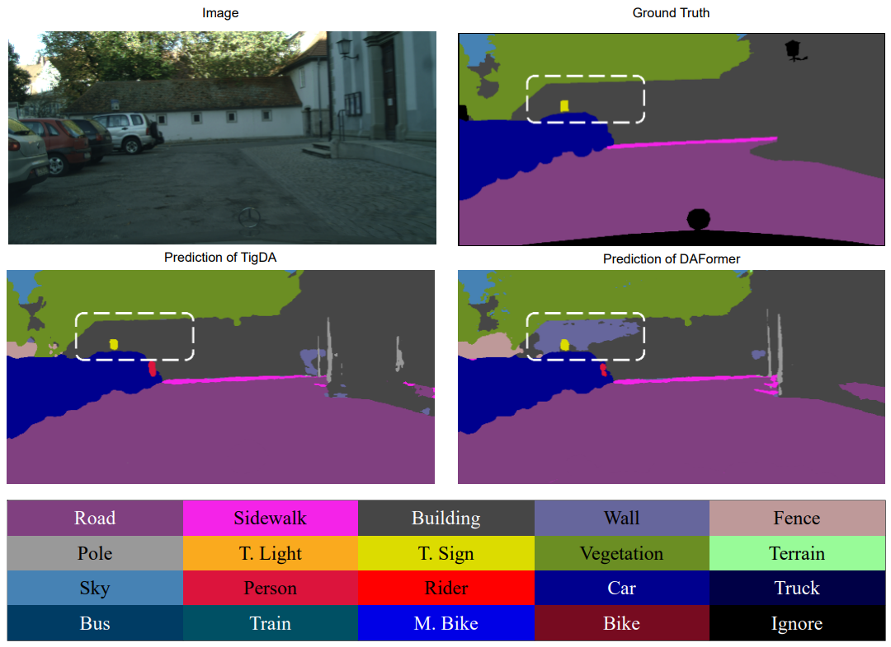

# TigDA

This repository contains project for class Application and Practice in Neural Networks<br>

This project is for detecting disease through endoscopy image.
<br>

This code is based on mmsegmentation

## Overview
 In deep learning, unsupervised domain adaptation (UDA) is commonly utilized when the availability of abundant labeled data is often limited. Several methods have been proposed for UDA to overcome the difficulty of distinguishing between semantically similar classes, such as *person* vs. *rider* and *road* vs. *sidewalk*. The confusion of the classes results from the collapse of the distance, caused by the domain shift, between classes in the feature space. 
 
 In this work, we present a versatile approach based on text-image correlation-guided domain adaptation (TigDA), which maintains a distance to properly adjust the decision boundaries between classes in the feature space. In our approach, the feature information is extracted through text embedding of classes and the aligning capability of the text features with the image features is achieved using the cross-modality. The resultant cross-modal features plays an essential role in generating pseudo-labels and calculating an auxiliary pixel-wise cross entropy loss to assist the image encoder in learning the distribution of cross-modal features. 
 
 Our TigDA achieved the highest performance among other UDA methods in both single-resolution and multi-resolution cases with the help of GTA5 and SYNTHIA for the source domain and Cityscapes for the target domain. 

 ## Model Performance
 ||GTA to Cityscapes|SYNTHIA to Cityscapes|
 |---|---|---|
 |DAFormer|68.3|60.9|
 |DAFormer + TigDA|70.0|62.8|
 |HRDA|73.8|65.8|
 |HRDA + Ours|74.2|67.0|

 

## Usage

### environments
- Ubuntu 20.04
- Python 3.8.5

### Requirements
- torch >= 1.8.0
- torchvision
- mmcv-full
- clip=1.0
- tqdm
- pandas

To use this code, please first install the 'mmcv-full' by following the official guideline guidelines ([`mmcv`](https://github.com/open-mmlab/mmcv/blob/master/README.md)).


The requqirements can be installed by the following command
```shell
pip install -r requirements.txt -f https://download.pytorch.org/whl/torch_stable.html
```

### Prepare dataset
**Citysacpes**: Please, download leftImg8bit_trainvaltest.zip and trainvaltest.zip from [`here`](https://www.cityscapes-dataset.com/)

<br>

**GTA**: Please download all images and label packages from [`here`](https://download.visinf.tu-darmstadt.de/data/from_games/)

<br>

**SYNTHIA**: Please download SYNTHIA-RAND-CITYSCAPES from [`here`](https://synthia-dataset.net/downloads/)

### Pre-trained backbone weight
please download the pre-trained weight for MiT-B5 via shell script
```shell
sh tools/download_checkpoints.sh
```

### Preprocessing the dataset
The following dataset is preprocessed in COCO format , but if you are using the raw json file you can preprocess with the script
```shell
python tools/convert_datasets/gta.py /your/path/.py
python tools/convert_datasets/cityscapes.py /your/path/.py
python tools/convert_datasets/synthia.py /your/path/.py
```

### Training
For convenience, provides and [annotated config file](configs/daformer/gta2cs_uda_pseudoclip_context.py) of the adaptation model

A training job can be launched using:

```shell
python run_experiment.py --config configs/daformer/gta2cs_uda_pseudoclip_context.py
```

### Evaluating
The checkpoint will be sevaed automatically in work_dirs, else you set a directory for it.

```shell
sh test.sh path/to/checkpoint/directory
```